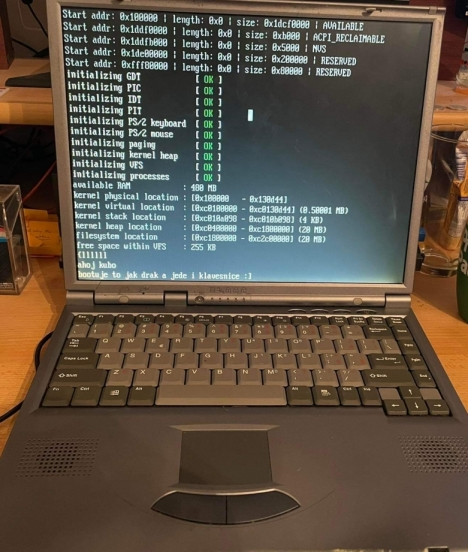

# DELOS 2.0

DELOS 2.0 is an educational project developed by students within the KIV/OS module at the University of West Bohemia. Its main purpose is to demonstrate basic functionality and techniques used when developing an operating system. The operating system runs in a 32-bit protected mode on a x86 processor.

## How to run it?

### Dependencies

In onder to successfully compile the kernel, you need to have the following tools installed on your system: `g++`, `ld`, `nasm`, `make`, `xxd`, and `genisoimage`.

The compilation process is done through the `make` command that is supposed to be executed in the root folder of the project structure.
Upon successful compilation, `DELOS-2.0.iso` will be generated. This file represents and `iso` image of the operating system that can be run in `VirtualBox` or `Qemu`.

## Implemented features

- [X] Segmentation
- [X] TSS segment
- [X] Kernel in higher-half
- [X] Interrupts
- [X] PIT
- [X] Kernel heap
- [X] Pseudo FAT12 file system
- [X] Screen driver
- [X] PS/2 Keyboard driver
- [X] PS/2 Mouse driver
- [X] Paging
- [X] CRT0
- [X] ELF loader
- [X] Userspace
- [X] stdlib
- [X] Processes (RR scheduler)
- [X] System calls (fork, getpid, wait, etc.)
- [X] Multiple terminals (CTRL+1, ..., CTRL+4)